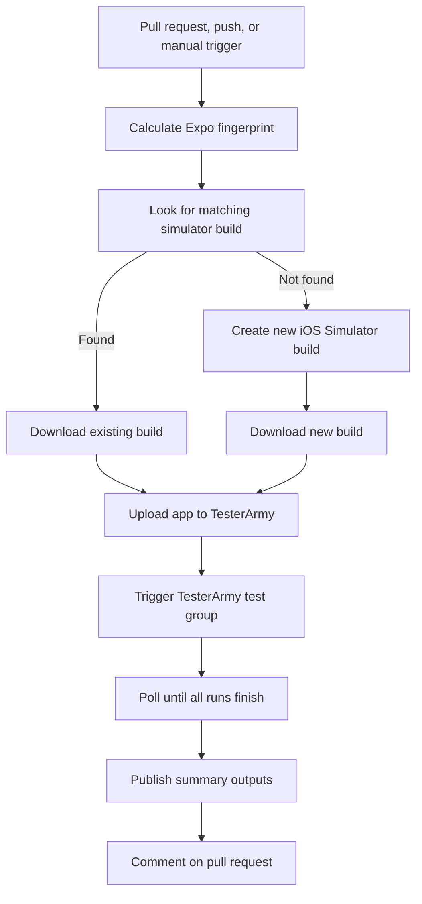

# Expo EAS + TesterArmy Integration Plan

## Summary

We want an Expo EAS workflow that automatically tests a mobile app with TesterArmy whenever a pull request changes the app. The workflow should avoid unnecessary rebuilds, upload the correct simulator app to TesterArmy, wait for test results, and report a clear summary back to the pull request.

The intended user experience is:

1. Developer opens or updates a pull request.
2. EAS checks whether an existing simulator build can be reused.
3. If needed, EAS builds a new simulator app.
4. TesterArmy runs the mobile test group against that app.
5. The pull request gets a readable comment with pass/fail results.

## Goals

- Run TesterArmy mobile tests from Expo EAS workflows.
- Build iOS Simulator apps suitable for cloud simulator testing.
- Reuse existing builds when app-native inputs have not changed.
- Keep PR feedback clear and actionable.
- Avoid leaking sensitive IDs or API keys in logs, comments, or links.
- Keep the integration reusable enough to apply to other Expo apps later.

## Proposed Workflow



## Key Concepts

### Expo Fingerprint

Expo fingerprinting creates a hash of the project inputs that affect the native build. We can use this hash to determine whether an existing simulator build is still valid.

If the fingerprint has not changed, we should reuse a previous build instead of paying the cost of another iOS build.

### Simulator Build Reuse

Before building, the workflow should ask EAS whether a completed or in-progress iOS Simulator build already exists for the current fingerprint.

If a match exists:

- Do not run a new build.
- Download the matching build artifact.
- Run TesterArmy tests against it.

If no match exists:

- Build a new iOS Simulator app.
- Download that new build artifact.
- Run TesterArmy tests against it.

### TesterArmy Test Execution

After a simulator app is available, the workflow should:

1. Archive the `.app` bundle if needed.
2. Upload the app to TesterArmy.
3. Trigger the configured TesterArmy webhook/test group.
4. Poll all triggered runs until every run reaches a final state.
5. Mark the EAS job as failed if any TesterArmy run fails.
6. Clean up the uploaded app after the run by default.

The workflow should not fail immediately on the first failed run. It should wait for all runs to finish so the final report is complete.

### Multiple TesterArmy Groups

The integration should support multiple TesterArmy groups in one workflow. The preferred model is:

- Build or reuse the simulator app once.
- Upload the app once if TesterArmy can reuse the uploaded app across groups.
- Trigger each configured group.
- Poll all resulting runs.
- Combine results into one PR comment.

The comment should group results by TesterArmy group when multiple groups are configured. For example:

```md
## Test Results (18/20 completed)

**Group:** Smoke Tests
...

**Group:** Pull Request Regression
...
```

If TesterArmy webhooks are group-specific, the workflow should accept a list of webhook URLs or group identifiers. API details should decide the final configuration shape.

## Required Configuration

The integration needs these values in the EAS environment:

| Variable                 | Secret?    | Purpose                                                      |
| ------------------------ | ---------- | ------------------------------------------------------------ |
| `TESTERARMY_API_KEY`     | Yes        | Authenticates API requests to TesterArmy.                    |
| `TESTERARMY_PROJECT_ID`  | Prefer yes | Identifies the TesterArmy project for uploads and test runs. |
| `TESTERARMY_WEBHOOK_URL` | Yes        | Triggers the configured TesterArmy test group.               |

Optional values:

| Variable                           | Default               | Purpose                                           |
| ---------------------------------- | --------------------- | ------------------------------------------------- |
| `TESTERARMY_API_BASE`              | `https://tester.army` | Allows staging or local API testing.              |
| `TESTERARMY_DELETE_APP_AFTER_RUN`  | `true`                | Deletes uploaded app after tests finish.          |
| `TESTERARMY_REMOVE_AFTER`          | `3600`                | Auto-expiration time for uploaded app in seconds. |
| `TESTERARMY_POLL_INTERVAL_SECONDS` | `10`                  | How often to poll run status.                     |
| `TESTERARMY_TIMEOUT_SECONDS`       | `1800`                | Maximum time to wait for TesterArmy results.      |

## Dashboard Links

PR comments should link to TesterArmy runs.

The desired dashboard link format is:

```text
https://tester.army/dashboard/<workspace_slug>/projects/<project_short_id>?run=<run_id>
```

To build that link safely:

- Use the TesterArmy project UUID only for API calls.
- Use public dashboard slugs for visible links.
- Resolve the project short ID from the TesterArmy project list API.
- Resolve the workspace slug from project metadata or the project dashboard URL.

This avoids putting secret project IDs into GitHub comments or EAS logs.

## Pull Request Comment

On pull requests, the workflow should post a summary comment similar to:

```md
[TesterArmy](https://tester.army/dashboard/<workspace_slug>/projects/<project_short_id>?run=<run_id>) ran mobile tests on this Pull Request.

## Test Results (2/2 completed)

**Group:** Mobile Simulator

| Test                                       | Status    | Duration |
| ------------------------------------------ | --------- | -------- |
| [Open app and verify homepage loaded](...) | ✅ Passed | 1m 7s    |
| [Click through tabs](...)                  | ❌ Failed | 51s      |

**1/2 passed**
**Commit:** `abc1234`
_Updated: Apr 28 2026, 12:13 PM UTC_
```

The comment should include:

- Link to TesterArmy dashboard or first run.
- Number of completed runs.
- Per-test status.
- Duration.
- Total pass/fail count.
- Commit short SHA when available.
- Updated timestamp.

## Workflow Outputs

The TesterArmy job should expose structured outputs that other workflow jobs can consume:

| Output      | Purpose                                                |
| ----------- | ------------------------------------------------------ |
| `dashboard` | JSON record with `name` and `link`.                    |
| `summary`   | Human-readable summary, e.g. `2/2 passed, 0/2 failed`. |
| `passed`    | Number of passed runs.                                 |
| `failed`    | Number of failed runs.                                 |
| `pending`   | Number of pending/timed-out runs.                      |
| `total`     | Total number of runs.                                  |
| `markdown`  | Full Markdown body for the PR comment.                 |

## Error Handling

The workflow should fail when:

- Uploading the app fails.
- The webhook trigger fails.
- TesterArmy does not return run IDs.
- Any run finishes as failed.
- Runs do not finish before timeout.

The failure output should be concise and readable. It should not dump bundled JavaScript or stack traces unless debugging is explicitly enabled.

## Security Considerations

- `TESTERARMY_API_KEY` must be secret.
- `TESTERARMY_WEBHOOK_URL` must be secret because it can trigger tests.
- `TESTERARMY_PROJECT_ID` can be treated as sensitive, but visible links should avoid relying on it.
- Dashboard links should use public slugs instead of the project UUID where possible.
- Logs should not print API keys, webhook URLs, upload URLs, or secret project IDs.

## UX Considerations

The workflow graph should be easy to understand:

- One fingerprint job.
- One build lookup job.
- One optional build job.
- One TesterArmy test job.
- One PR comment job.

Avoid separate TesterArmy jobs for cache hit and cache miss paths. A single test job should consume whichever build artifact is selected.

## Local Testing Strategy

Local testing should cover two levels:

### Runner Logic

Use a mocked TesterArmy server to validate:

- App archiving.
- Upload request shape.
- Webhook trigger payload.
- Polling behavior.
- Pass/fail output.
- PR Markdown generation.
- Dashboard link generation.

### EAS Build

Use local EAS build to validate:

- The Expo app can produce an iOS Simulator build.
- The custom build config is valid.
- The test runner can execute after the build artifact exists.

Full workflow features like fingerprint lookup, build reuse, and GitHub PR comments should be validated in EAS-hosted workflows.

## Decisions So Far

- Do not add Android emulator support in the first version. Keep the initial integration focused on iOS Simulator builds.
- Support multiple TesterArmy groups per workflow. Teams should be able to run more than one test group against the same selected simulator build.
- Keep build reuse enabled as part of the core design. Do not add an “always build fresh” option to the initial plan.

## Reuse Options With Expo EAS

Expo EAS gives us a few practical reuse paths:

1. **Repository template**
   - Ship example `.eas/workflows` and `.eas/build` files that teams copy into their app repo.
   - Lowest friction for a first version.
   - Easy to understand and customize.
   - Updates are manual.

2. **Reusable custom build functions**
   - EAS custom build configs support importing functions from other local config files.
   - This helps organize shared functions inside a repo.
   - It does not appear to support importing functions directly from an external package or remote URL.

3. **NPM package for runner logic**
   - Publish the TesterArmy runner as an npm package.
   - Workflow scripts can call it with `npx` or install it during the job.
   - Easier to update centrally than copied TypeScript bundles.
   - Adds dependency install/runtime considerations to workflow jobs.

4. **Scaffold command**
   - Provide a CLI command that writes the EAS workflow/build files into a repo.
   - Good compromise between template copying and central maintainability.
   - Can update existing files with migrations later.

5. **Future EAS integration**
   - If Expo adds marketplace-style workflow integrations, external workflow imports, or custom UI actions, TesterArmy could become a more first-class EAS integration.
   - Today, the supported path is workflow YAML, custom jobs, custom build configs, and local or packaged scripts.

Krzysztof: The easiest path is release package so we can use it npx package-name@latest. This would allow us to update workflow files without having our users update the workflow files themselves.

## Open Questions

1. Can TesterArmy expose a direct dashboard URL in each run API response?
2. Can TesterArmy expose workspace slug explicitly in the project list response?
3. Should PR comments be updated in place or posted as a new comment on every run?
4. Should failed runs include detailed failure reasons in the PR comment?
5. Should the reusable distribution be a copyable template, npm package, scaffold command, or combination?

## Recommended Rollout

### Phase 1: Prototype

- Implement EAS workflow for one Expo app.
- Support iOS Simulator only.
- Run TesterArmy on pull requests.
- Post PR summary comment.
- Validate dashboard links and failure handling.

### Phase 2: Harden

- Test with failed, passed, and timed-out TesterArmy runs.
- Confirm behavior when existing EAS builds are reused.
- Confirm behavior when no matching build exists.
- Verify secret masking does not break links or comments.
- Improve run API parsing based on real payloads.

### Phase 3: Reuse

- Extract the runner into a reusable package or template.
- Document setup for other Expo apps.
- Add examples for common EAS environments.
- Add multi-group examples once configuration shape is finalized.

### Phase 4: Productize

- Publish official TesterArmy + EAS integration docs.
- Add screenshots of PR comments and EAS workflow graph.
- Consider a generator/scaffold command.
- Explore deeper EAS UI integration if Expo exposes custom buttons or annotations.
